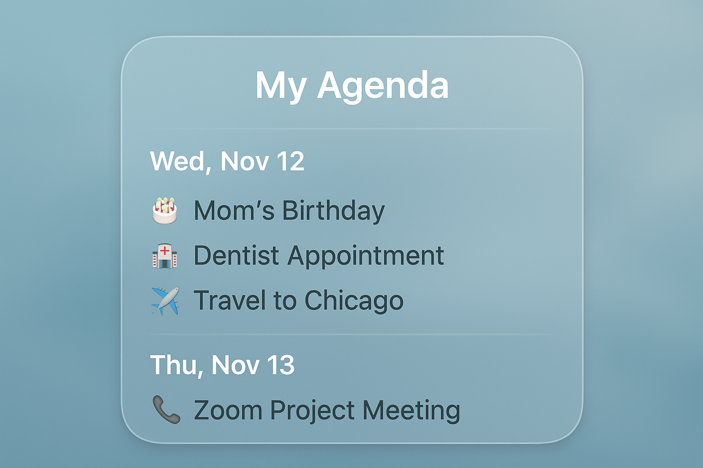
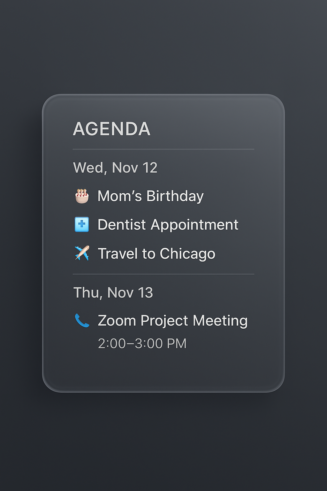

# MMM-MyAgenda

Standalone MagicMirror module that renders a multi-day agenda with an **iOS liquid glass** theme, color-coded calendars and custom icons. It supports direct `.ics` parsing via `ical`, smart event grouping, contextual icons, and an elegant frosted-glass UI consistent with **MMM-AmbientWeather**.  

### Day



### Night


---

## ✨ Features

- 🗓️ Multi-day **agenda list**, grouped by day headers  
- 🧭 Configurable **date range** (`startOffsetDays`, `numDays`)  
- 🎨 **iOS liquid-glass** UI with blur, shimmer, and 3D hover  
- 🧩 **Color-coded contextual icons** for events  
- 🕓 **Smart full-day detection** (handles 04:00–04:00 or 12:00–12:00 timezone offsets)  
- 🪄 Optional **descriptions** and **title truncation**  
- 🔤 Inline **text filtering** to remove unwanted prefixes (“Private:”, “Busy”, etc.)  
- 🚫 **Duplicate suppression** (based on title + time hash)  
- ⚙️ Compatible with either the **MagicMirror calendar module** or direct `.ics` feeds  
- Accepts events from MagicMirror core `calendar` module (`CALENDAR_EVENTS`) or fetches `.ics` feeds directly via node helper.
- Color coding per calendar (via `calendarColors` or ICS `color`).
- Custom icons per calendar or per event (`iconMapping`, or event `icon` property).
- Mini-month overview plus per-day agenda.
- Liquid glass frosted UI theme, responsive.
- Event transformer hook for custom logic.
-Uses ical to parse .ics feeds robustly (including RRULEs, EXDATEs, and timezone handling).
-Expands recurring events within a rolling 3-month window (1 month before, 2 months after today).
-Skips duplicates and exceptions.
-Logs cleanly to MagicMirror’s console.
-Sends notifications to the front-end for rendering.

---

## 🧱 Installation

```
bash
cd ~/MagicMirror/modules
git clone https://github.com/yourusername/MMM-MyAgenda.git
cd MMM-MyAgenda
npm install
```

---
 
## Example Config

```js
{
  module: "MMM-MyAgenda",
  position: "top_right",
  header: "Agenda",
  config: {
    useCalendarModule: false,        // false = fetch from .ics URLs, true = use CALENDAR_EVENTS
    calendars: [
      {
        name: "Personal",
        url: "https://calendar.google.com/calendar/ical/your_calendar.ics"
      },
      {
        name: "Work",
        url: "https://yourcompany.com/work.ics"
      }
    ],

    // Display range
    startOffsetDays: 0,              // days from today (e.g. -1 = include yesterday)
    numDays: 7,                      // how many days to display

    // Appearance
    maxTitleLength: 30,              // truncate long titles, 0 = unlimited
    showDescription: true,           // show event description below title
    maxDescriptionLength: 80,        // truncate long descriptions

    // Text filtering (remove unwanted words, case-insensitive)
    filterText: ["Private:", "(Busy)", "[Tentative]"],

    // Refresh rate
    interval: 30 * 60 * 1000,        // every 30 minutes
  }
}
```

---

## 🧭 Validation & Testing

To test:

Run ```npm install``` in your module directory.

Start MagicMirror and watch logs via:

```npm start dev```

You should see lines like:

``[MMM-MyAgenda Helper] Registered calendar: Family, update every 30 min
[MMM-MyAgenda Helper] Registered calendar: Colton Homework, update every 30 min```


Events with recurrence (RRULE) should now properly appear for each occurrence within the visible date window.

---

## 🎨 Visual Design

```MMM-MyAgenda``` inherits its design language from ```MMM-AmbientWeather```, using a liquid-glass effect with shimmer and raised edges.

Each event shows:

A colored icon based on its title keyword (e.g. “🎂” for birthdays, “📞” for meetings)

A clean title (filtered and optionally truncated)

A subtle description line in gray italics

---

## Keyword → Icon / Color Map

| Keyword               | Icon | Color     |
| --------------------- | ---- | --------- |
| birthday, anniversary | 🎂   | `#f472b6` |
| meeting, call, zoom   | 📞   | `#3b82f6` |
| doctor, dentist       | 🏥   | `#60a5fa` |
| math, exam, test      | 🧮   | `#a78bfa` |
| soccer, game, sport   | ⚽    | `#22c55e` |
| travel, flight        | ✈️   | `#f59e0b` |
| default               | 🗓️  | `#9ca3af` |

---

## 🧩 Example

📅 Example Display

```vbnet
 ┌────────────────────────────┐
 │      My Agenda             │
 │────────────────────────────│
 │ Wed, Nov 12                │
 │ 🎂  Mom’s Birthday          │
 │ 🏥  Dentist Appointment     │ 10:00–11:00 AM
 │ ✈️  Travel to Chicago       │
 │────────────────────────────│
 │ Thu, Nov 13                │
 │ 📞  Zoom Project Meeting    │ 2:00–3:00 PM
 └────────────────────────────┘
```
(Times omitted for full-day events.)

---

## 🧰 Advanced Notes

### Data Sources

You can use:

The core MagicMirror ```calendar``` module’s broadcast (```useCalendarModule: true```)

Direct ```.ics``` URLs (```useCalendarModule: false```) via the included Node helper, which uses ```ical``` for robust recurrence handling.

### Duplicate Removal

Events are deduplicated based on:

```js
(title + startDate + endDate).toLowerCase()
```
This prevents repeated entries from overlapping feeds or recurring expansions.

### Title Filtering

The ```filterText``` option strips phrases from titles, not events:
```js
"Private: John's Birthday" → "John's Birthday"
```

---

## 🎨 Styling

If you want to adjust the visual theme, edit:
```
MMM-MyAgenda.css
```

---

## 🧑‍💻 Author & License

Author: Harry Arter & ChatGPT (GPT-5)
License: MIT
Version: 1.3.0

---

## 📦 Dependencies

ical
 ^0.9.0

node-fetch
 ^3.3.2

Install automatically with:

```bash
npm install
```

---

## 💡 Tips

Combine with MMM-AmbientWeather for a cohesive dashboard aesthetic.

Use maxTitleLength to prevent text wrapping in narrow regions.

For 24-hour clocks, you can change the time format in formatTime() inside the JS file.

---

## 🪄 Upcoming Enhancements

Optional mini-month calendar overlay

Support for per-calendar color mapping

Fade-in animation on day transitions

---

## 🧩 Example Repository Layout

```go

MMM-MyAgenda/
├── MMM-MyAgenda.js
├── MMM-MyAgenda.css
├── node_helper.js
├── package.json
├── README.md
└── docs/
    ├── preview_day.png
    └── preview_night.png
```
---

Enjoy your new MagicMirror Liquid-Glass Agenda! 🪞💎

## ✅ Summary of Upgrade

| Feature                      | Before               | Now                   |
| ---------------------------- | -------------------- | --------------------- |
| ICS parsing                  | manual string parser | robust `ical` library |
| Recurrence support           | ❌ none               | ✅ full RRULE, EXDATE  |
| Configurable fetch intervals | ✅                    | ✅                     |
| Timezone handling            | partial              | ✅ (ical built-in)     |
| Reliability                  | good                 | **production-grade**  |
