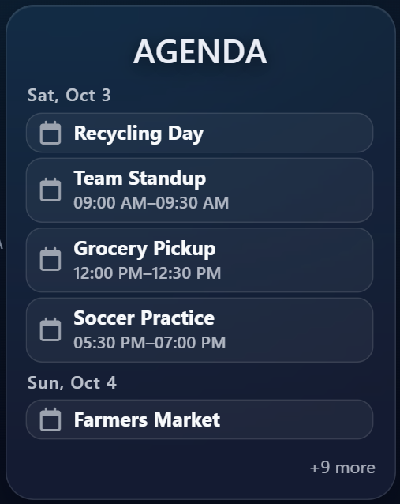

# MMM-MyAgenda

A MagicMirror module that renders a multi-day agenda list with a liquid-glass
theme, color-coded calendars, and contextual icons. It can pull events either
from the core `calendar` module's `CALENDAR_EVENTS` broadcast, or fetch
`.ics` feeds directly via its own node_helper (using
[node-ical](https://www.npmjs.com/package/node-ical) for parsing, including
RRULE recurrence, EXDATE exceptions, and RECURRENCE-ID overrides).

<p align="center">
  
</p>

*The agenda card in the night theme with sample events: all-day and timed events grouped by day,
and a "+N more" line when the list is longer than the card.*

---

## Features

- Multi-day agenda list, grouped by day headers.
- Configurable date range (`startOffsetDays`, `numDays`).
- Liquid-glass UI with blur, shimmer, and hover effects, matching
  MMM-AmbientWeather's visual language.
- Color-coded, keyword-based icons for events (`iconMapping` / `iconEmojis`
  plus `keywordColors`), and per-calendar coloring (`calendarColors`).
- Full-day detection for all-day or near-24h events.
- Optional event descriptions and title truncation.
- Text filtering: strip fragments from titles (`filterText`) and hide whole
  events by title fragment (`excludeText`).
- Duplicate suppression across overlapping feeds.
- Works with either the MagicMirror core `calendar` module
  (`useCalendarModule: true`) or direct `.ics` URLs fetched by the included
  node_helper.
- Recurring events are expanded with RRULE, honoring EXDATE (cancelled
  instances) and RECURRENCE-ID (moved/edited instances).
- A failed or unreachable feed shows a visible error/warning instead of
  silently looking like an empty calendar.

---

## Installation

```bash
cd ~/MagicMirror/modules
git clone https://github.com/hearter20176/MMM-MyAgenda.git
cd MMM-MyAgenda
npm install
```

---

## Update

```bash
cd ~/MagicMirror/modules/MMM-MyAgenda
git pull
npm install --omit=dev
```

Then restart MagicMirror (for example `pm2 restart MagicMirror`).

## Configuration

```js
{
  module: "MMM-MyAgenda",
  position: "top_right",
  header: "Agenda",
  config: {
    useCalendarModule: false, // false = fetch from .ics URLs, true = use CALENDAR_EVENTS
    calendars: [
      {
        name: "Personal",
        url: "https://calendar.google.com/calendar/ical/your_calendar.ics"
      },
      {
        name: "Work",
        url: "https://yourcompany.com/work.ics"
      }
    ],

    // Display range
    startOffsetDays: 0, // days from today (e.g. -1 = include yesterday)
    numDays: 7, // how many days to display, inclusive of the start day

    // Appearance
    maxWidth: 420,
    maxEvents: 12,
    maxTitleLength: 30, // truncate long titles, 0 = unlimited
    wrapEventTitles: true,
    showDescription: true,
    maxDescriptionLength: 80,

    // Text filtering (case-insensitive)
    filterText: ["Private:", "(Busy)", "[Tentative]"], // stripped from displayed titles
    excludeText: [], // events containing any of these fragments are hidden entirely

    // Mapping + colors
    calendarColors: {
      Work: "#FF5733",
      Personal: "#33C1FF"
    },
    iconMapping: {
      Meeting: "fa-solid fa-handshake-simple",
      Birthday: "fa-solid fa-cake-candles"
    },
    iconEmojis: {},
    keywordColors: {
      Urgent: "#FF0000",
      Optional: "#AAAAAA"
    },

    removeDuplicates: true,

    // Refresh rate (only used when fetching .ics feeds directly)
    interval: 30 * 60 * 1000, // every 30 minutes

    debug: false
  }
},
```

---

## Options

| Option | Type | Default | Description |
| --- | --- | --- | --- |
| `header` | string | `"Agenda"` | Card header text. Overridden by the module's own `header` config property if set. |
| `useCalendarModule` | boolean | `false` | `true` to source events from the core `calendar` module's `CALENDAR_EVENTS` broadcast instead of fetching `.ics` feeds directly. |
| `calendars` | array | `[]` | Only used when `useCalendarModule` is `false`. Array of `{ name, url }` ICS sources. |
| `startOffsetDays` | number | `0` | Days from today the display window starts. Negative includes past days. |
| `numDays` | number | `5` | Number of days shown, inclusive of the start day. |
| `startDayIndex` | number | — | Legacy alias for `startOffsetDays`. |
| `endDayIndex` | number | — | Legacy alias; combined with `startDayIndex`/`startOffsetDays` to derive `numDays`. |
| `maxWidth` | number | `420` | Card max width in px. Lower it when two agendas share a row. |
| `maxEvents` | number | `12` | Cap on displayed events, with a "+N more" line for the rest. `0` = unlimited, letting the display window decide how many events there are. Either way, after rendering the module also trims any trailing rows that still don't fit the card's height and rolls those into the same "+N more" count, so the list never silently clips. |
| `maxTitleLength` | number | `0` | Truncate event titles past this many characters. `0` = unlimited. |
| `wrapEventTitles` | boolean | `true` | Wrap long titles instead of a single line. |
| `showDescription` | boolean | `false` | Show the event description under the title. |
| `maxDescriptionLength` | number | `80` | Truncate descriptions past this many characters. `0` = unlimited. |
| `filterText` | array/string | `[]` | Fragments stripped from displayed titles (case-insensitive). Does not hide events. |
| `excludeText` | array/string | `[]` | Events whose title contains any of these fragments are hidden entirely (case-insensitive). |
| `keywordColors` | object | `{}` | Map of title keyword -> color, highest priority color source. |
| `calendarColors` | object | `{}` | Map of calendar/source name -> color. |
| `iconMapping` | object | `{}` | Map of title keyword -> Font Awesome class string (e.g. `"fa-solid fa-dna"`). |
| `iconEmojis` | object | `{}` | Map of title keyword -> emoji/character icon, used if no `iconMapping` match. |
| `removeDuplicates` | boolean | `true` | Drop events with an identical title + start + end across sources. |
| `interval` | number | `5 * 60 * 1000` | Only used when fetching `.ics` feeds directly: refresh interval in ms. |
| `debug` | boolean | `false` | Log per-source event counts: to the browser console from the front end, and to the MagicMirror server log from node_helper (both gated on this flag; node_helper otherwise stays silent on success and only logs failures). |

---

## Error and status handling

- If every configured source fails and there are no events to show at all,
  the card shows "Calendar unavailable: `<name>` (`<reason>`)" instead of
  silently looking empty.
- If some events are available but a source failed, a small warning line
  ("Some calendars failed to update") is shown above the list.
- If a source's fetch failed but a cached copy (up to 7 days old) was used
  instead, a warning line shows how old that cached data is.
- If `calendars` is empty and `useCalendarModule` is `false`, the card shows
  "No calendars configured" instead of "No upcoming events".
- If `useCalendarModule` is `true` and no `CALENDAR_EVENTS` notification
  arrives within 60 seconds, the card shows a waiting message instead of
  spinning forever.

---

## Data Sources

- Core MagicMirror `calendar` module's broadcast (`useCalendarModule: true`).
- Direct `.ics` URLs (`useCalendarModule: false`) via the included
  node_helper, which uses `node-ical` for RRULE/EXDATE/RECURRENCE-ID-aware
  recurrence handling.

ICS feeds are fetched with a `User-Agent` header (some providers, e.g.
Canvas/Instructure, reject requests without one with HTTP 403),
`webcal://` URLs are converted to `https://`, and redirects are followed.

---

## Styling

Edit `MMM-MyAgenda.css` to adjust the visual theme. Selectors specific to
this module's card styling (`.glass-card`, `.raised-edge`, and their
keyframes) are scoped under `.MMM-MyAgenda` so they don't affect other
modules that use a similar glass-card look.

---

## Testing

```bash
npm test
```

Runs the `node --test` suite in `test/`, covering RRULE/EXDATE/RECURRENCE-ID
expansion, per-source error/warning status, and fetch-timer reuse. All
fixtures are synthetic; no real calendar data is used in tests.

---

## Dependencies

- [`node-ical`](https://www.npmjs.com/package/node-ical) — ICS parsing and
  recurrence expansion.
- [`boxicons`](https://www.npmjs.com/package/boxicons) and
  [`iconoir`](https://www.npmjs.com/package/iconoir) — optional icon fonts
  for `iconMapping`.

Install with `npm install` from the module directory.

---

## Author & License

Author: Harry Arter & ChatGPT (GPT-5)
License: MIT
Version: 1.1.0
